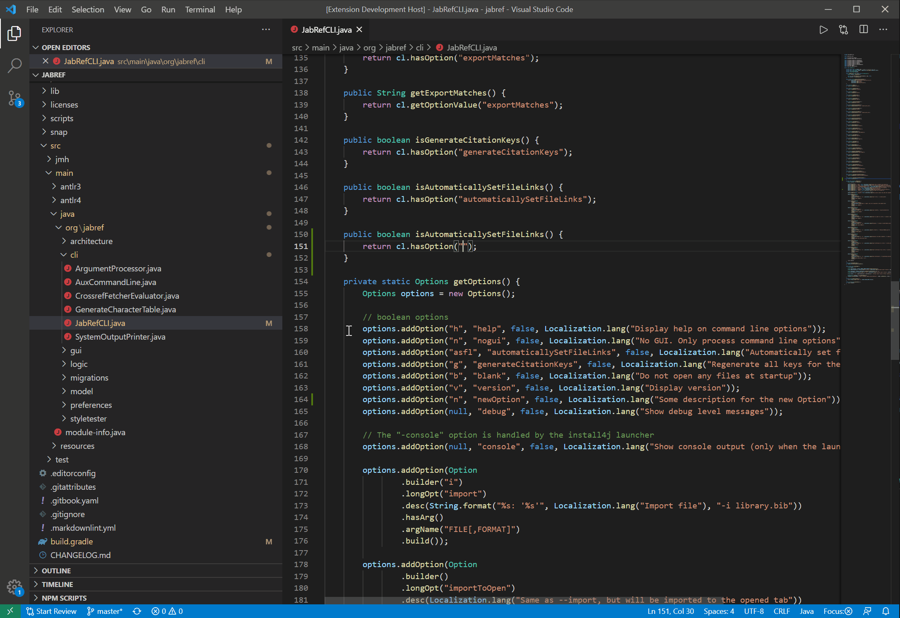

# Git Quick Review for Visual Studio Code

Quickly check out a remote git branch you want to review without worrying about your current working state. After finishing the review, you will be brought back to where you left off without losing any changes.

## Requirements

This extension only works when VSCode is openend in a workspace with an initialized git repository.

## Features

This extension let's you quickly check out a remote git branch you want to review without you having to worry about your current working state.
Essentially, this plugin aims to provide a shortcut for the following workflow when doing a git review.

1) Quickly select and switch to a branch you want to review
    - Save current changes
    - Refresh the remote for the newest working states
    - Find the branch you want to review
    - Checkout the selected remote branch in detached mode

--- Unfortunately, you still need to perform the review by yourself ---

2) Quickly switch back to your original branch and working state
    - discard any changes
    - Checkout original branch you worked on
    - Restore original working state

## Usage

1. Simply select the git quick review status bar icon on the bottom left which should say 'Start Review'. (Alternatively, open your command pallete and search for *Git Review*).
2. Select the branch you want to review
3. Perform your code review on the checked out branch
4. Press the git quick review status bar icon again to finish a review which brings you back to your original branch and restores your previous work.

## Change Log

The Change Log can be found [here](CHANGELOG.md).

## Contributing

Fork the [repo](https://github.com/boceckts/vscode-git-quick-review), create a branch and submit pull requests.
